# ompare
Extensible compare across two and more disconnected IRIS / Cache environments.
This code has had a lot of useful exercise in production environments and has been re-packaged to share freely in the hope it will be useful to wider Cache / IRIS user community. 

What makes ompare different from other code comparison utilities:
1) Can compare configuration and data as well as code
 - For example: Namespace mappings, Scheduled Tasks (The Useful columns), Productions, Lookup Tables 
3) Compare side-by-side 2,5,10 or even 20 environments that are deployed on different isolated networks
5) See a summary of *what actual thing* is different ie: Parameter, Property, Method Code, Method Signature, XData, Lookup Table, SQL View
 - Then drill down into *that thing* summary to view property, method signature, code or row difference.
6) See *real* functional differences in code not just formatting
  -  Ignores the order of Methods in Classes or LineLabels in Routines
  -  Ignores comments in Classes or routines
  -  Ignores irrelevant whitespace or empty lines.
  -  Ignores routine legacy formatting differences
  -  Can ignore version control strings in code
7) Extensible - Please suggest or add custom new comparitors and reuse the existing reporting framework
8) Reporting as interactive HTML application and also Excel for sharing ofline difference summaries with customers.
9) Excel Workbook - Aggregate multiple reports as summary level worsheets into a downloadable Excel Workbook. 
10) Privacy - It is an option to profile only signatures of code and config instead of actual implementation, in case code is commercially sensitive.
- When "signature only", the drill-down to source link is not available in HTML reporting but other functionality can work.
11) Exclude system or platform code from being profiled to focus only on your product or customizations.
12) Profile code once and configure multilpe reports that slice or focus on specific areas of differences.
13) Profile 2, 10 or even 50 different namespaces accross an instance with a single task.
14) Recently used for porting between code Cache 2010.2 and IRIS 2019.3. The Class Source Handler has been reimplemented to *replace with* IRIS naming conventions and defaults, to focus on real code differences while excluding platform version default differences.

# Client install
Excludes any reporting elements of code that are not required for profiling systems


 Name | Purpose
 -----|---------------------------------------------------
 ompare.Schedule | The profile utility. It can run as a scheduled task or can be run from the commandline
 ompare.SourceHandler.Base | The base class for code or config profilers
 ompare.SourceHandler.Class | Profiles class differences
 ompare.SourceHandler.Lookup | Profiles Integration LookupTables
 ompare.SourceHandler.Mapping | Profiles the mapping configuration of Namespaces to Databases for Globals, Routines and Packages
 ompare.SourceHandler.Namespace | Profiles some general instance settings
 ompare.SourceHandler.Routine | Profiles Routines
 ompare.SourceHandler.SQLTable | Flexible profile of anything with a SQL Projection so Sheduled Tasks, Productions, List of Users etc
 
## How to configure the Schedule to Profile code
Install in one namespace for example can be the USER namespace<br>
Generates one Signature file and optionally one Source file for ALL namespaces selected for profile on an instance.<br>
Example from IRIS Session
```objectScript
set tBASE=##class(ompare.Schedule).%New()
set tBASE.Environment="BASE"
set tBASE.Namespaces="OMPARE-BASE,INST-*,-INST-TEMP"
set tBASE.RunSourceHandlers=1
set tBASE.ExportToFile=1
set tBASE.ExportDirectory="C:\TMP\ompare\"
set tBASE.ExportCompression=0
set tBASE.DiscardProfileData=1
set tBASE.RetainExportDays=0
set tBASE.IncludeSourceCode=1
set tSC1=tBASE.OnTask()
```

 Setting | Meaning
 --------|--------
 Environment | Logical Reporting context. The context to compare *System A* with *System B*, *C* and *D*. This can simply be for example "BASE", "TEST", UAT", "PROD" for only code differences. However for Mirroring comparison of nodes for namespaces and schedule tasks you might have a task with distinct "node name" for example PROD_1A, PROD_1B, PROD_2A, PROD_2B.
 Namespaces | Flexible expression of namespaces on instance to profile. Supports wildcard suffix and also "-" prefix to negate inclusion from ealier rule.
 RunSourceHandlers | Yes when profiling an instance. No for reporting import or in code backup mode.
 ExportToFile | Generates a flat file with name format:
 ExportDirectory | Directory to output Signature and Source extracts to. Must be a directory that is writable by the service account of a scheduled task
 ExportCompression | Compression has been useful where the profile and the reporting server have been the same version in the past.
 DiscardProfileData | Profile Data ^ompare("Data") and ^ompare("DataSrc") is generated in the namespace the tool is installed. Can be discarded for servers only being profiled.
 RetainExportDays | Number of days to retain profile exports / imports for
 IncludeSourceCode | This collects actual code not just signatures for export
 OnTask | This method starts the profile
 


# Server install
Includes all code elements.

Copy the export files from target instances to the report server.
Then load signatures and code profiled into the report instance.

Example from IRIS Session

```objectScript
set tRPT=##class(ompare.Schedule).%New()
set tRPT.Environment="RPT"
set tRPT.Namespaces="USER"
set tRPT.RunSourceHandlers=0
set tRPT.ExportToFile=0
set tRPT.ImportDirectory="/tmp/SourceCompare/Import/"
set tRPT.ImportFromFile=1
set tRPT.ReImportUpdatedFiles=1
set tRPT.DeleteImportedFiles=1
set tRPT.RetainExportDays=2
set tRPT.IncludeSourceCode=1
set tRPT.RetainSigSrcHistoricVersions=-1
set tRPT.OverwriteSourceOnReLoad=1
set tSC1=tRPT.OnTask()
```

 Setting | Meaning
 --------|--------
 Environment | Always require this setting
 Namespaces | Always require this setting
 RunSourceHandlers | No. Not profiling so can be disabled for import
 ExportToFile | No. Not profiling or backing up so no need to generate an export file
 ImportDirectory | Directory to read multiple new signature and source files from
 ImportFromFile | Yes importing code signatures and optionally code for reporting
 DeleteImportedFiles | Once processed can delete obsolte files
 RetainExportDays | Number of days to retain files in import directory before deleting
 OverwriteSourceOnReLoad | Can be useful when itterating new versions Source Handlers for the comare tool.
 
 # Reporting
 
 After importing code signatures and code views from another system you can configure one or reports to compare and examine differences with flexible options. 
 Navigate to page http://[reportServer]:[webport]/csp/user/ompare.Report.Main.cls
  
 New settings for a report:<br>
 
 Setting | Meaning
 --------|-----------------------
 Report Name | A unique name for this report view
 From Environment | This is the one environment that you which to compare all other environments against
 Display Different Detail | Whether you want just a high level summary or a to support drill down of code and config differences
 List Category | Allows one or more Reports to be organised for easier management
 Excel Worksheet Name | The Tab name displayed on the worksheet

Select a source namespace in the "From Environment" and then namespaces from other environments to compare.

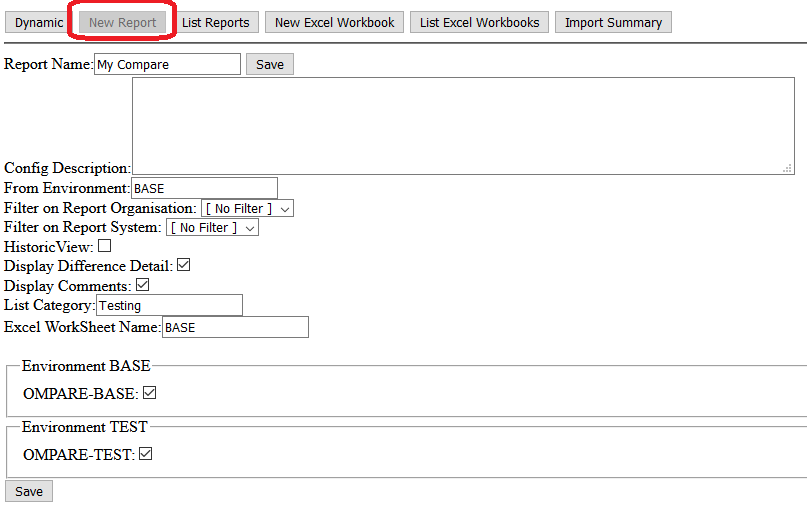

## Classes, routines or compare just everything
After saving first time there will be a slew of options for what subset of reporting you actually require.
There is a Save button at both the *top* and the *bottom* of the page.
This makes it possible to select only what you need. For example a report that only looks at just class differences.
This is useful down the line, for example if you want to generate an Excel report summary with Class Differences in one tab and then Routine differences in a second seperate Tab.
You can choose to report on all aspect of classes or perhaps only on Properties and Method signatures (Useful for deployed code or third party libraries).
## Extra, Missing, Difference, Same
Within this there are options to look at *extra*, *missing*, *differences* or *same* in each category and sub-category.
Generally selecting *differences*, *extra* plus *missing* checkboxes is a good starting configuration.<br>
## Exclude, Include

In some report configuration sections you will see textareas for "exclude" and "include". These filter by name of the resource you need. For example if you had a project or application area with specific classes and routine names, you can configure the report to only include these specific items for comparison. Wild card suffix supported. You may find that profiling has imported a load of platform or intergation classes on one of the target instances. Using Exclude is where you can easily filter out all that noise instead of having to reun a profile in a slight different configuration.<br>
Exclude and Include are complementary. For example: The coarse Exclude pattern "Tool.\*" with include pattern "Tool.ProjectA.\*"

This would give:
 Classname | Result
 ----------|--------
 Tool.UnitTest.T1 | Excluded
 Tool.UnitTest.T2 | Excluded
 Tool.ProjectA.Base | Included
 Tool.ProjectA.ImplA | Included
 Tool.ProjectA.ImplB | Included
 Tool.ProjectB.SmartFormA | Excluded
 Tool.ProjectB.SmartFormB | Excluded

This form is extensible by adding new profile and report types.

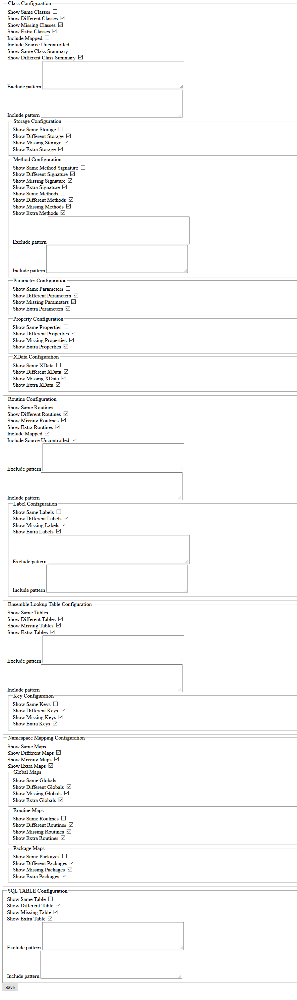

# HTML Report View

The HTML report view gives a side by side difference of characteristics selected in the report definition for each target environment.
Simply select *View* in list of Reports or select *View* within Report Edit mode.
There are in-page links to quickly jump to a given section for long reports. Also At the start of each section is an in-page link back to the top of the report, to speed up navigation.
Each section has an Item counter, useful for discussion of differences in a team call.
The "From Environment" column is useful in the case of class dependencies where we display the names of sub-classes that may be affected / impacted.
Subsequent columns are for each logical target environment where differences exist. Reminder you can have 2 or 20 target environments to compare against, and the reporting will still be expected to be quick.
*Extra* class means a whole resource is additional in a *target environment* (TEST) than compared with *From Environment* (BASE).
*Missing* class means a whole resource is missing in a *target environment* (TEST) than compared with *From Environment* (BASE).
For sub-types have their own descreet section. This is followed by a bulleted list of sub-type name. For example names of properties or Method Signature or Method Implementation with actual difference.

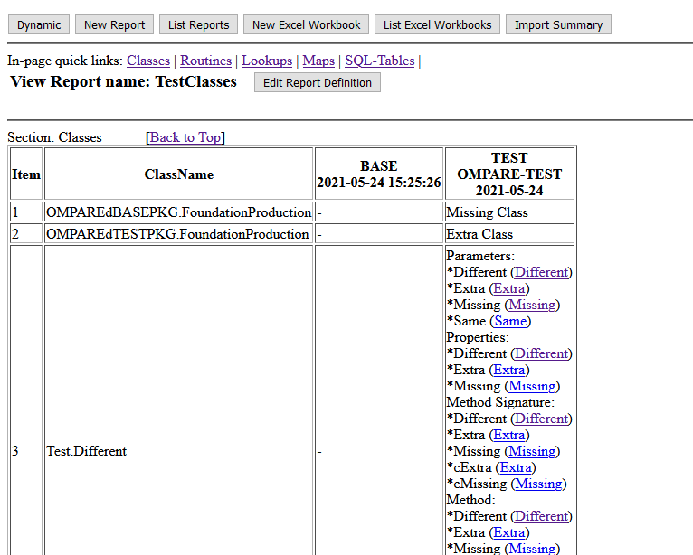

In brackets in there is a hyperlink (Different, Extra, Missing), this will launch drill down source code difference view
This uses functionality from the CodeMirror project to highlight code differences and also collapse sections of code that are the same to understand differences in large methods or routine LineLabels.

Examples of drill down code diff

Method signature:<br>


Method implementation:<br>
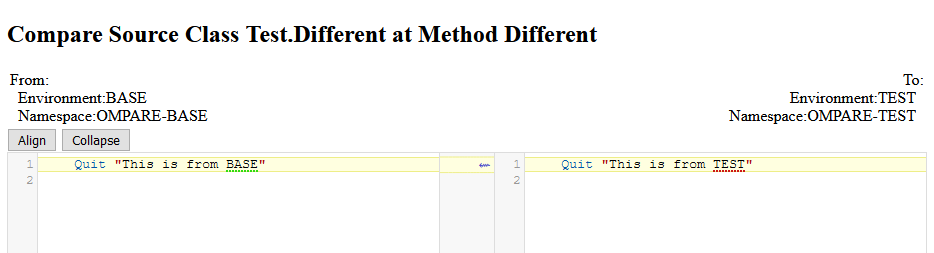

Global Mapping of Namespace difference<br>
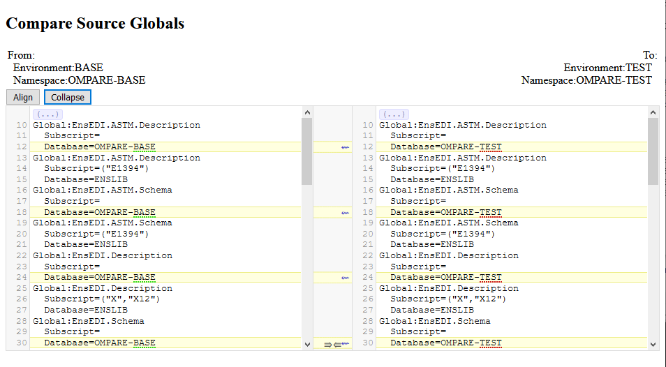

## Comment collaberation
Activated to be visible in reports by the option "Show Comments" in report defintions.
When the detail of code difference is viewed there is an option to add a comment.

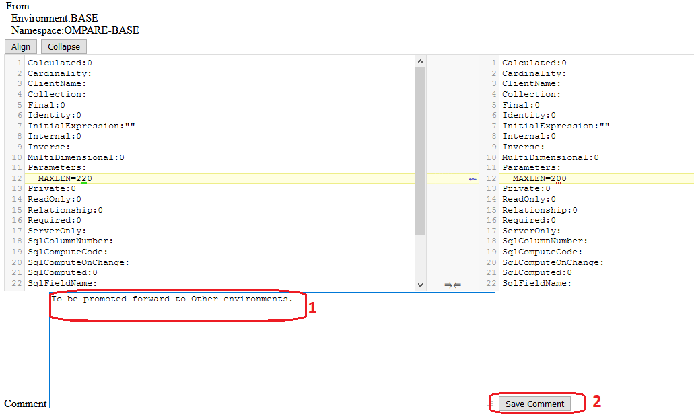

Whenn the HTML report summary view is refreshed this comment is displayed against that specific code item.

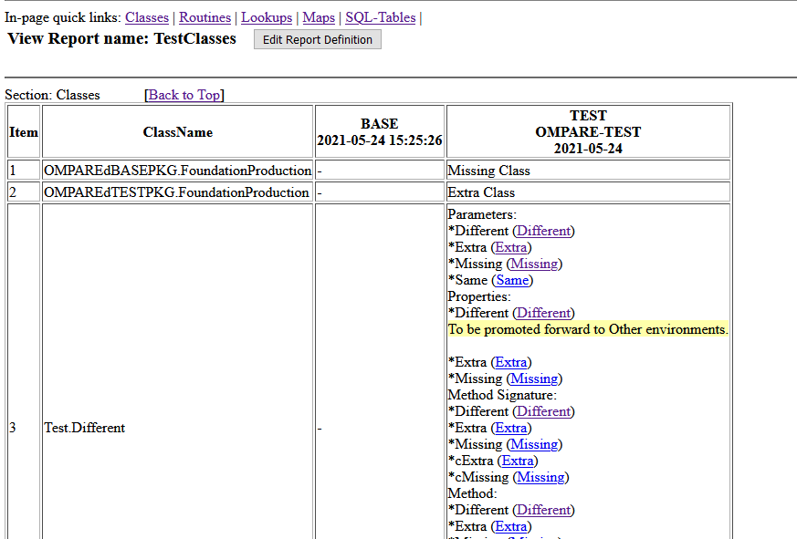


# Excel Report

To create a new Summary Excel sharable Report select *New Excel Workbook*.
Fill out the text items.
New Report Tabs are added by selecting from the worksheets select list.
To delete existing Report Tabs click the *X* in the Report column. (NB: This doesn't destroy the original source report).

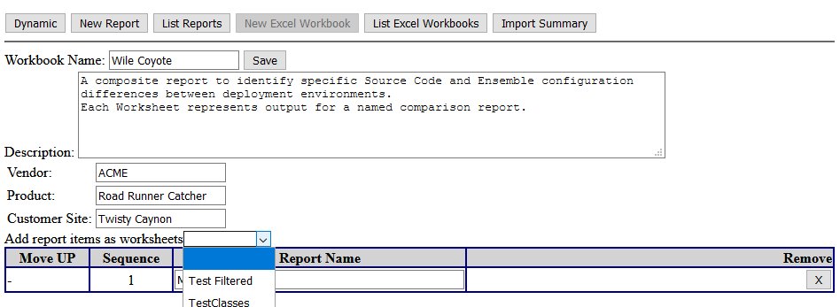

When there are multiple tabs already added their order can be rearranged by toggling the up-n-down buttons on the left.
A lot more conventient than forcing to be added in correct order.

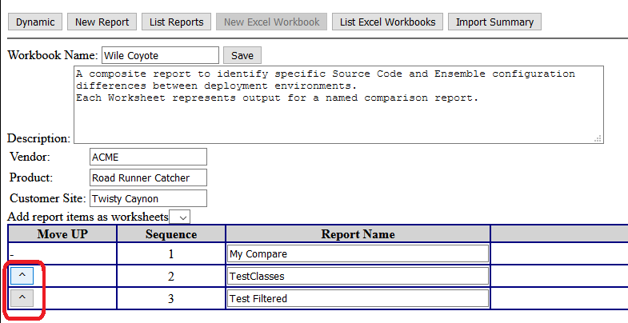

The Excel Report is downloaded from the *List Excel Workbooks* view.
Click the link and select save. Open the Excel document to review. Resave as binary Excel if required.

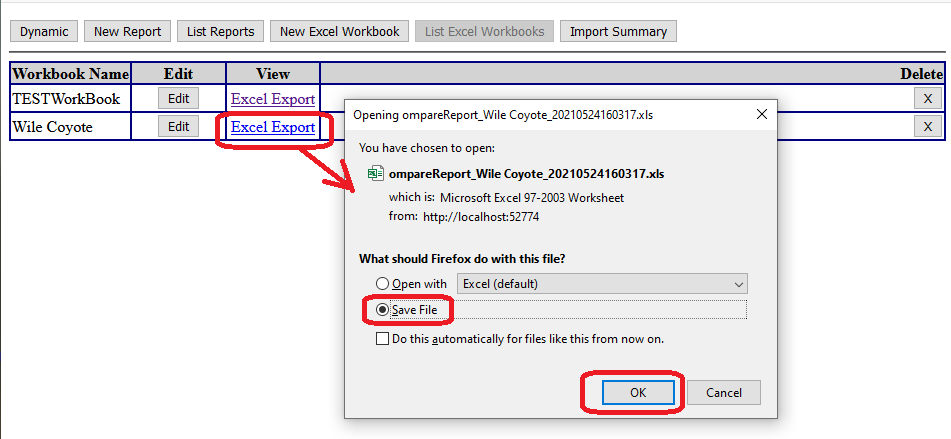

A workbook as a coversheet (first tab) based on Excel Report settings given.

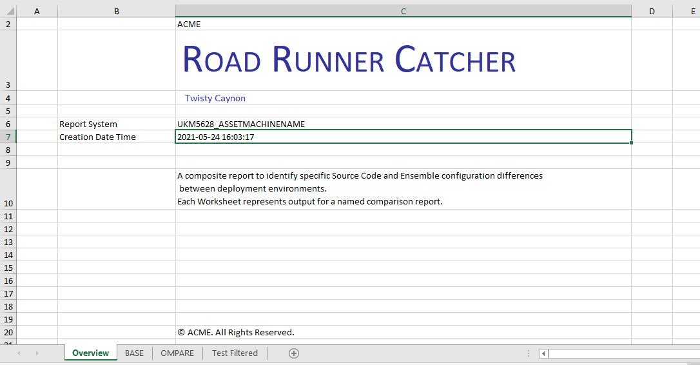

Examples of Report Tab. Demonstrates:
- Rows are pre-expanded to to view contents easily.
- There are no links to differences, only a summary with counts of differences encountered

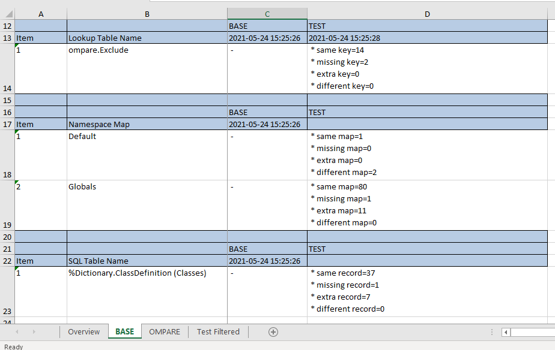


 
 
 
 
 
 
 
 
 
 

