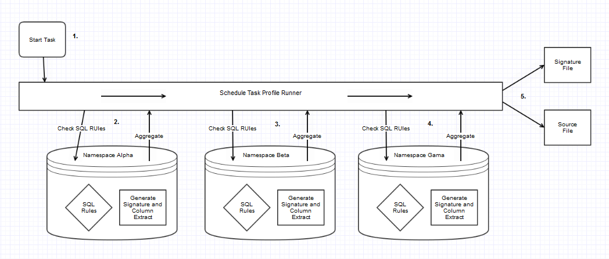
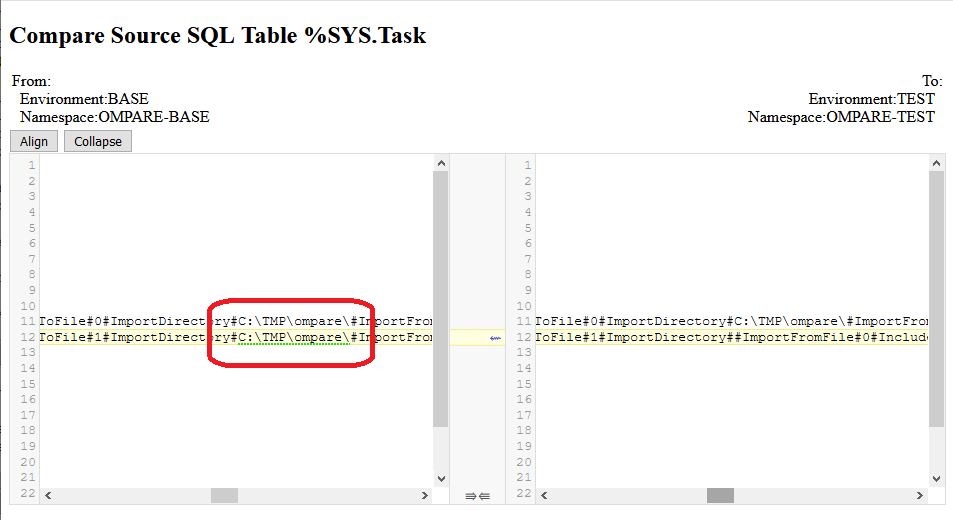

# SQL Compare

This area of profiling and reporting operates in the following manner:
1) The profiler Task Schedule detects the SQL SourceHandler and runs this across one or more namespaces
2) In each namespace the SQL SourceHandler encounters one or more SQL profile rules
2) When rules are processed this runs SQL with selective export of column data and signatures based on each rule output
2) These SQL signatures and content are exported along with other profile data in a signature file and file per instance
3) The Signatures and content files transferred and imported into into the aggregating reporting service
4) Reports configured to selectively include SQL Rules for comparison




Rules are configured per namespace in global for example:
```
^ompare("Config","SQL","%Dictionary.ClassDefinition,Classes")="1,1,1000,Name,Super,Name![%~&Name!=SchemaMap.Map.*"
```

What this is asking to profile:
- Select data from SQL Table %Dictionary.ClassDefinition
- For reporting set the Rule alias to "Classes". This allows you to have multipe profiles on the same table but with different criteria
- This SQL rule is enabled
- Export column data for up to 10000 rows
- The unique key for this data is composed of the column "Name". This allows you to select one or more columns as a key regardless of automatic rowid generated locally by each system
- For data columns export column "Super"
- As filtering criteria:
  - Ignore records where the column "Name" contains "%". ie: Percent system classes
  - AND specifically also ignore columns that start with Names starting with "SchemaMap.Map."

##How to configure rule for capturing Schedule Tasks.
```
^ompare("Config","SQL","%SYS.Task")="1,1,10000,Name,Namespace~Description~RescheduleOnStart~DailyEndTime~DailyFrequency~DailyFrequencyTime~DailyIncrement~DailyStartTime~DisplayRun~DisplayRunAfter~Priority~RunAsUser~Settings~TaskClass"
```
What this is asking to profile:
- Select data from SQL Table %SYS.Task
- For reportingthere is no alias for the name "%SYS.Task" will default.
- This SQL rule is enabled
- Export column data for up to 10000 rows
- The unique key for this data is composed of the column "Name". Ignore automatic rowid generated locally by each system as these can be added in a different order.
- For data columns export useful columns: Description, RescheduleOnStart, DailyEndTime, DailyFrequency, DailyFrequencyTime, DailyIncrement, DailyStartTime, DisplayRun, DisplayRunAfter, Priority, RunAsUser, Settings, TaskClass

Useful info:
The columns settings in IRIS is stored and output as a list. The profiler translates these nested lists with delimiter characters. 
This allows visual inspection for detailed differencing of the Settings column 
List are automatically traslated in this manner consistently for the whole utility.
Do not save multiple Schedule Tasks with the same name. A warning is given when the profile is run manually for which column (TaskName) has a duplication.

Reporting Detail view for SQL comparisons showing the setting "ImportDirectory" has value in one instance but not in another:



Additional notes:
- To exclude System tasks then simply add the filter "%ID>1000"
- For scheduled Tasks this information is system wide, so a SQL rule only needs to be configured to run in one namespace
- In MIRRORED systems, to run on Backup instance must be a Namespace with non-MIRRORED routine Database. Suggest have a Profile Scheduled Task that runs only in USER namespace specifically for reporting on instance wide node specific configuration. 
For instance information use profile names (PROD_1A, PROD_1B, PROD_2A, PROD_2B) for a task that runs on each servers (Primary, Backup or ASync) ie:
For MIRRORED database content (Classes, Routines, Application Data) use environment distinct name (BASE, TEST, UAT or LIVE) for a ScheduleTask that only configured to runs on Primary MIRROR.

##How to configure rule for Current Producton Settings

